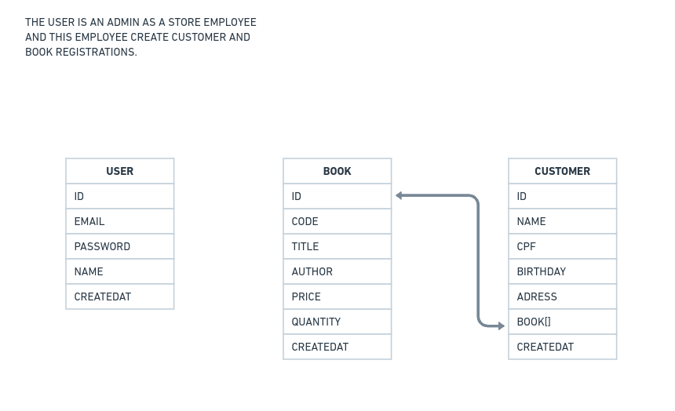

# Book Store

book store api is used for a book store to control books. The api allow the user register clients, books, and which book each client bought.


Requirements:
 - one book can have many copies
 - the quantity of book should decrease with each sale.
 

Dependencies:
express, prisma ORM

- next features: 
financial

Initialize project:

Routes:


Create postgres container:

```
sudo docker network create --driver bridge postgres-network

sudo docker run --name postgres --network=postgres-network -e "POSTGRES_PASSWORD=postgres" -p 5432:5432 -v /home/larissa/Documentos/projetoso:/var/lib/postgresql/data -d postgres 

sudo docker run --name pgadmin --network=postgres-network -p 15432:80 -e "PGADMIN_DEFAULT_EMAIL=lari_santin@hotmail.com" -e "PGADMIN_DEFAULT_PASSWORD=pgadmin" -d dpage/pgadmin4
```


